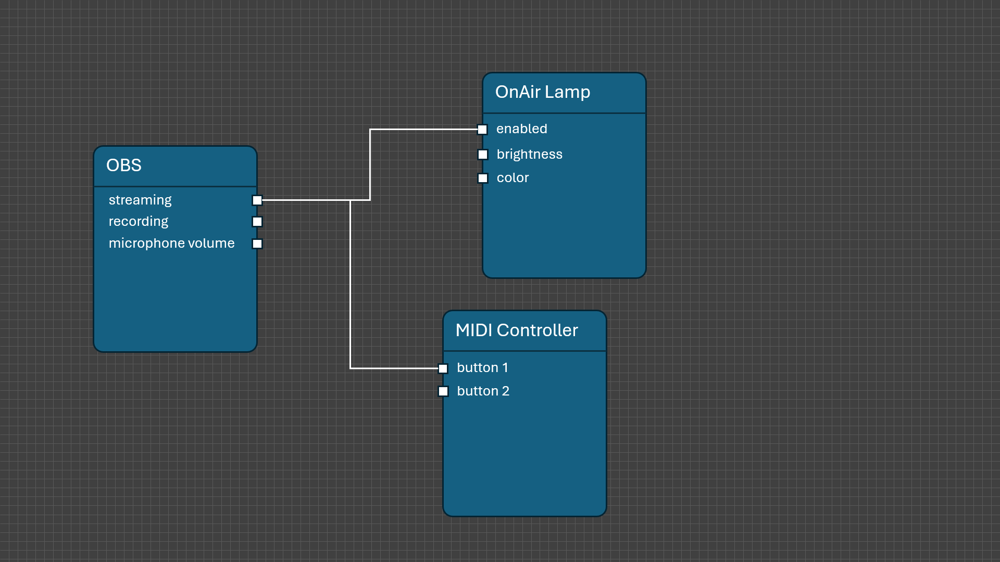

# OctoPatch

Welcome to OctoPatch, the ultimate integration tool specifically crafted for streamers and content creators who want to professionalize their broadcast without breaking the bank. OctoPatch empowers even amateur streamers with budget-friendly equipment to achieve a professional studio setup. By seamlessly integrating open-source and affordable tools, OctoPatch overcomes their inherent limitations, providing enhanced control and interaction possibilities. With OctoPatch, streamers can unlock new levels of performance, making advanced streaming setups accessible and manageable for everyone.

## Installation

To install OctoPatch just download the msi-file from the newest release and follow the stops of the wizard. The installer will ad a new start menu entry for it.

## Vision

The main idea behind OctoPatch is an easy to use integration tool for all kind of scenarios where things should synchronize over several devices or applications. OctoPatch should offer here a drawing area where you can place all required applications or connected devices. They will show up as nodes and offer a bunch of connectors - one connector for each property or state. By drawing lines, all that properties can be synchronized. That means any changes on any of the two sides of the wire will trigger a change on the other side.

## Usecases

This is the place where I want to add some useful usecases and how to setup them. For now its empty. But feel free to add more of your ideas and wishes to the discussions.
